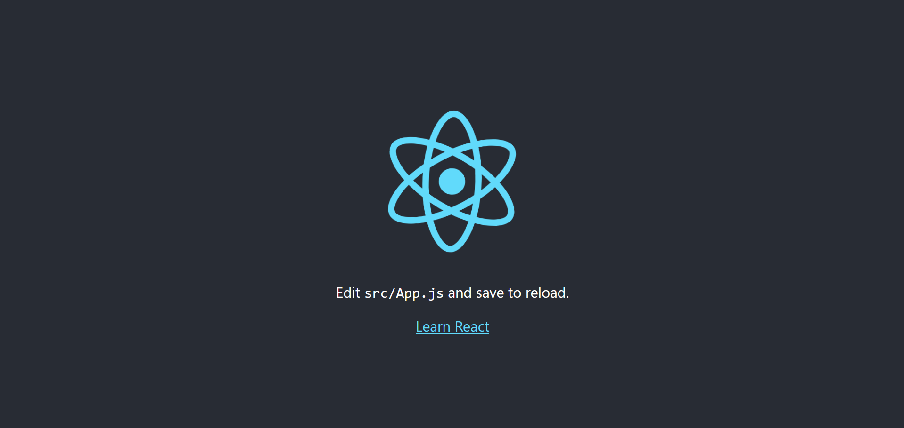

# finance-app-react
React-based frontend for the Finance App


  # Setup Instructions

## 1. Install Node.js
- Download and install the latest stable version of **Node.js** from the official website.
 
  ```bash
  https://nodejs.org/en
  ```


  

  
## 2. Open the Project Folder in Terminal
- Choose the folder where you want to create your project.
- Right-click inside the folder and select **Open in Terminal**
  
## 3. Install Yarn
- In the terminal, run the following command to install **Yarn**
 
  ```bash
  npm install yarn
  ```


  


## 4. Create a New React Project
- Use Yarn to create a new React application by executing:
  
  ```bash
  yarn create react-app finance-app-react
  ```

## 5. Open the Project in Visual Studio Code
- Once the project is created, open the **finance-app-react** folder in Visual Studio Code.

## 6. Start the Development Server
- In the Visual Studio Code terminal, run:
  
  ```bash
  yarn start
  ```
- This will start the development server and open the application in your default browser



# Expo

## 1. Install the Expo App
- Use the following command to create a new Expo project:
  
  ```bash
  npx create-expo-app finance-app-expo
  ```

## 2. Run the Demo Expo App
- To start the development server and run the demo app:
  
  ```bash
  npx expo start
  ```

## 3. Reset the Project
- Before you begin developing your own app, remove the default demo screens and content created by Expo.
Then, clear the cache using the following command:
  
  ```bash
  npm run reset-project
  ```
## 4. Add the Following Screens to Your App
- Create these files inside the app/ directory:
  
  ```bash
  login.tsx
  register.tsx
  ```

## 5. Install Package for Timezone Picker
- Create these files inside the app/ directory:
  
  ```bash
  npx expo install @react-native-picker/picker
  ```
